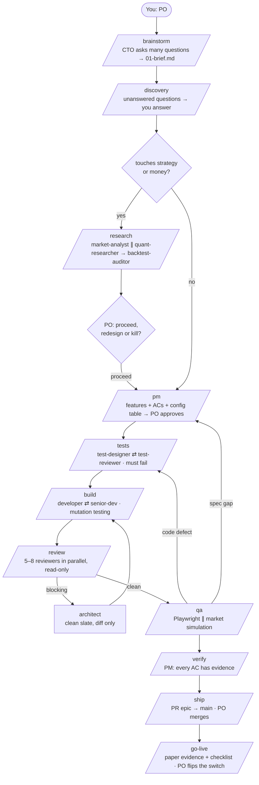

# Agentic SDLC: Trading Edition

A software company made of Claude Code agents, with you as the Product Owner.
The generic core is portable to any project. The trading layer switches on automatically when an epic
touches money or strategy.

---

## 1. The idea in one paragraph

Stop treating Claude Code as "a coder". Treat it as a **company**. Every role is a separate agent with
its own clean context window. Work moves between roles through **files** (never shared memory) and
through **hard gates**: a stage can't pass until the next role signs off. You're the only human, and
you sit in one seat: **Product Owner**. You decide *what* and *why*. The company handles *how*.

## 2. The org chart

| Role | Model | Can write code? | Job |
|------|-------|-----------------|-----|
| **PO** (you) | human | – | Has the idea, answers questions, approves the spec, merges, approves go-live |
| **CTO** (main session) | strong | ❌ | Brainstorms with you, dispatches agents, moves files, tracks state |
| discovery | opus | ❌ | Lists only the unanswered questions |
| pm | opus | ❌ | Spec, acceptance criteria, config table, epic plan. Verifies at the end |
| explore | haiku | ❌ | Cheap lookups (git history, file locations) for other agents |
| test-designer | opus | tests only | Failing tests from the spec |
| test-reviewer | opus | ❌ | "Are we testing our code or our mocks?" |
| developer | sonnet | ✅ | Best possible implementation |
| senior-dev | opus | ❌ | Independent verification, mutation testing, sends it back |
| review panel ×5 | opus/sonnet | ❌ | Security · changes · general · DRY · compliance (in parallel) |
| architect | opus | ❌ | Clean-slate judge of blocking findings, sees the diff only |
| qa | sonnet | e2e only | Drives the real app through Playwright, screenshots everything |
| **Trading layer** | | | |
| market-analyst | sonnet | ❌ | Market structure, macro events, data sources. Daily briefs |
| quant-researcher | opus | research/ only | Falsifiable hypothesis, pre-registered criteria, kill criteria |
| backtest-auditor | opus | ❌ | Hunts lookahead, survivorship, overfitting, missing costs |
| reviewer-risk | opus | ❌ | Traces every path to the exchange. Fail-closed. Limits |
| reviewer-exchange | opus | ❌ | Precision, order lifecycle, WebSockets, rate limits, testnet/mainnet |
| reviewer-latency | sonnet | ❌ | Hot-path audit, blocking calls, LLMs on the order path |
| qa-simulation | sonnet | sim harness only | Replays markets with fault injection. Invariants must hold |

**Thinking roles get the strong model. Doing and lookup roles get the cheap one.** Save extended
thinking for brainstorm, research, architect and senior review.

## 3. The pipeline

Two loops are mandatory: **test-designer ⇄ test-reviewer** and **developer ⇄ senior-dev**. Every loop
has a round cap, so nothing loops forever. Deadlocks go to the architect or to you.

## 4. The rules that make it work

1. **The CTO never builds.** Once the main session starts editing code, you lose context isolation
   and it collapses back into a normal chat.
2. **No code before the brainstorm is done.** Output quality comes from how much context the CTO
   extracted from you.
3. **Files are the handoff.** Agents don't share memory. Everything lives in `docs/sdlc/<epic>/`
   (see `.claude/knowledge/protocol.md`), and that folder doubles as your audit trail.
4. **Tests are honest.** They're written first, they fail for the right reason, they don't mock our
   own code, and senior-dev checks them with mutation testing afterwards. The high test counts from
   the lesson (thousands a month) are worth chasing, but only with mutation scores backing them.
   Otherwise the number means nothing.
5. **Traceability.** Every acceptance criterion has an ID (`F2.AC3`) that shows up in test names,
   commits and the final verification table.
6. **Context hygiene.** The architect gets the diff only. Reviewers are read-only. The PM never reads
   git history and asks explore instead.
7. **Implicit requirements.** Secure by default, data-driven by default, and the trading invariants.
   They're written down once and every agent inherits them.
8. **Git is the backbone.** `epic/<slug>` → `feat/<slug>/<Fn>`. Parallel features get separate
   worktrees and file-ownership maps, so there are no merge conflicts.
9. **Portable agents.** The core never mentions a specific project. Project facts live in the
   CLAUDE.md Project block, filled by `/onboard`.
10. **Keep CLAUDE.md short.** It's a routing file. The depth is in `.claude/`.

## 5. The trading layer: what it adds and why

| Risk in a trading app | What catches it |
|-----------------------|-----------------|
| Building a strategy that has no edge | `/research`: pre-registered hypothesis, kill criteria, backtest audit |
| A bug that sends 10× the size, or double-submits | reviewer-risk + invariants A1–A10 + simulation S3/S4 |
| Exchange quirks (precision, 24h WS disconnects, rate bans) | reviewer-exchange + recorded fixtures |
| Copying too late (the edge is in the gap) | reviewer-latency + per-stage latency metrics (C6) |
| Macro events blowing through stops | market-analyst → configurable blackout windows |
| An LLM "double-check" stalling or overriding orders | invariants F1–F3 + simulation S12 |
| Going live on backtest hope | `/go-live`: paper evidence, kill-switch drill, starter capital tier, your explicit approval |

**What the pipeline can and can't do:** it can make sure your software does exactly what you decided,
safely and fast. It can't create an edge that isn't in the market. That's what `/research` and the
paper period are there to find out honestly.

## 6. Your day-to-day

| Step | Your effort |
|------|-------------|
| `/brainstorm <idea>` | **High.** Answer at length. This sets the ceiling on quality. |
| `/discovery` | Medium. Answer, or accept the defaults. |
| `/research` | Medium. Read the hypothesis and kill criteria, then decide. |
| `/pm` | **High.** Scrutinise the ACs and the config table. This is your main leverage point. |
| `/tests` → `/build` → `/review` | Low. Walk away. |
| `/qa` | Low. Look at the screenshots and the simulation table. |
| `/verify` → `/ship` | Low. Read the verdict, then merge the PR. |
| `/go-live` | **High.** Do the manual key checks yourself and approve explicitly. |
| `/market-brief` | Optional, any morning. |
| `/status` | Any time. |

See `docs/SETUP.md` to install, and `docs/RUNTIME-AGENTS.md` for the agents that live *inside* the app.
