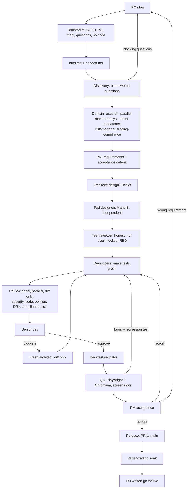

# Agentic SDLC

You (the user) are the **PO**. The main Claude Code session is the **CTO**: it brainstorms with you and orchestrates subagents, and never does tasks itself.

## Roles and models
| Role | Agent | Model | Why |
|---|---|---|---|
| Open questions | `discovery` | opus | thinking |
| Requirements, acceptance | `pm` | opus | thinking |
| Design, blocker resolution | `architect` | opus | thinking |
| Test design and review | `test-designer` x2, `test-reviewer` | opus | tests are the spec |
| Implementation | `developer` | sonnet | implementation |
| Code review | `senior-dev`, `security-reviewer`, `code-reviewer` | opus | thinking |
| Style / DRY / compliance review | `opinion-reviewer`, `dry-reviewer`, `compliance-reviewer` | sonnet | pattern work |
| QA | `qa` | sonnet | drives browser |
| History and small lookups | `history-explorer` | haiku | cheap |
| Trading domain | `market-analyst`, `quant-researcher`, `risk-manager`, `trading-compliance` | opus | thinking |
| Backtest audit, release | `backtest-validator`, `release-manager` | sonnet | procedural |

Run day to day at low or medium effort; raise it only for design, quant methodology and risk.

## Commands
`/brainstorm <idea>` -> `/epic <slug>` (or `/feature <slug> <desc>` for small work) -> `/review` (any time) -> `/release <slug>`.

## Principles
- **Abstract agents.** Generic agents know nothing about trading; project facts live in `CLAUDE.md`, `.claude/repo.md`, `docs/product/` and the four trading agents. To reuse the SDLC elsewhere, copy the generic agents and drop the trading ones.
- **Stateless reviewers** get only the diff. **PMs never read git history**; `history-explorer` answers small questions.
- **Tests first and red.** See `testing-policy.md`.
- **Implicit requirements** in `implicit-requirements.md` apply to every epic.
- **Branches and GitHub.** Everything merges to `main` via PR. Big features are epics on `epic/<slug>` so two big changes do not collide; each epic declares the modules it touches.
- **Artifacts, not chat.** Every phase writes to `docs/epics/<slug>/` (brief, questions, requirements, design, tests, review, backtest-report, qa + screenshots, acceptance, status).
- **CLAUDE.md stays short.**

## Human checkpoints
You approve: the brief; requirements; the merge to `main`; and, separately, any enablement of live trading. Everything else runs without you but is auditable in `docs/epics/<slug>/`.

## Known limits
Subagents cannot spawn subagents, so the CTO session runs the loops. Playwright needs the app runnable headless in the environment. Regulatory outputs are research to bring to counsel, not legal advice.
